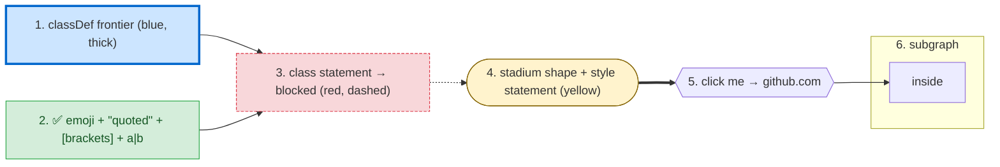

# Mermaid probe (Zed preview)

Check each numbered item in the preview.

```mermaid
flowchart LR
  classDef done fill:#d4edda,stroke:#28a745,color:#155724
  classDef frontier fill:#cce5ff,stroke:#0066cc,stroke-width:3px
  classDef blocked fill:#f8d7da,stroke:#dc3545,stroke-dasharray:4 2
  t215["1. classDef frontier (blue, thick)"]:::frontier
  t216["2. ✅ emoji + #quot;quoted#quot; + #91;brackets#93; + a#124;b"]:::done
  t217["3. class statement → blocked (red, dashed)"]
  t218(["4. stadium shape + style statement (yellow)"])
  t219{{"5. click me → github.com"}}
  t215 --> t217
  t216 --> t217
  t217 -.-> t218
  t218 ==> t219
  class t217 blocked
  style t218 fill:#fff3cd,stroke:#856404
  click t219 "https://github.com/banked/ask-barry/issues/214" "tooltip"
  subgraph S["6. subgraph"]
    t220["inside"]
  end
  t219 --> t220
```

```mermaid
flowchart TD
  broken["7. deliberately invalid → what does a parse error look like?
```
